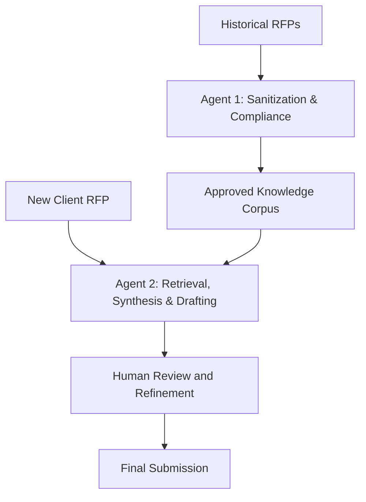

# Governed Agentic RFP Workflow
A conceptual two-agent architecture for improving RFP development in a global enterprise professional-services organization.
This project was developed as my capstone for the MIT Professional Education program in Applied Agentic AI for Organizational Transformation (Feb'26).

## The business problem
Enterprise RFP responses are frequently manual, fragmented, and produced under significant time pressure. Historical submissions contain valuable institutional knowledge, but privacy and confidentiality constraints often prevent their safe reuse.

## The proposed approach
The architecture separates two fundamentally different responsibilities:
1. **Sanitization and Compliance Agent**  
   Processes historical material asynchronously, removes sensitive information, and creates a governed knowledge corpus.
2. **Retrieval, Synthesis and Drafting Agent**  
   Helps consultants retrieve relevant precedents, generate grounded first drafts, and identify areas requiring original human judgment.

A controlled orchestration layer prevents the drafting agent from accessing raw, unsanitized material. All client-facing outputs remain subject to human review.

## Design principles
- Separation of compliance and productivity concerns
- Retrieval-grounded generation
- Least-privilege access
- Human accountability
- Auditability and data lineage
- Progressive scaling from pilot to production
- Business value measured through productivity, quality, adoption, and risk

## Architecture

